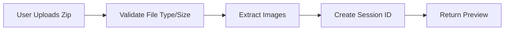
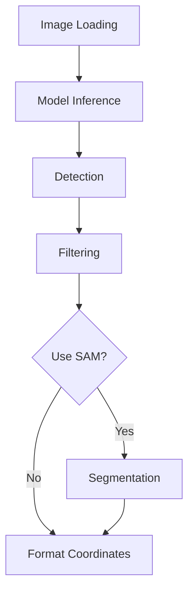
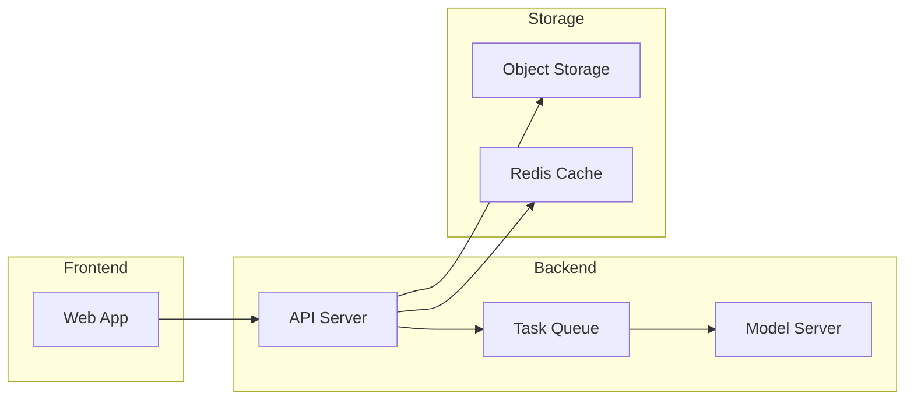

# Auto Annotation Tool with Grounding DINO - Implementation Guide

> A comprehensive roadmap for building an automated image annotation system using Grounding DINO for zero-shot object detection.

---

## Table of Contents

1. [System Components](#1-system-components)
2. [Training Requirements](#2-training-requirements)
3. [Input Requirements](#3-input-requirements)
4. [Processing Steps](#4-processing-steps)
5. [Output Delivered](#5-output-delivered)
6. [Technical Specifications](#6-technical-specifications)
7. [Success Criteria](#7-success-criteria)
8. [Implementation Timeline](#8-implementation-timeline)
9. [Testing Checklist](#9-testing-checklist)
10. [Deployment Considerations](#10-deployment-considerations)

---

## 1. System Components

### Frontend (User Interface)

#### What to Build:

| Component | Description |
|-----------|-------------|
| **Upload Page** | Drag-and-drop zip file upload interface |
| **Configuration Page** | Object description input forms with threshold sliders |
| **Progress Dashboard** | Real-time annotation progress visualization |
| **Annotation Viewer** | Image display with bounding box overlays |
| **Export Page** | Format selection and download options |

#### Features to Include:

- Session management (save/load configurations)
- Batch processing queue
- Annotation editing tools
- Quality control panel
- Export format preview

---

### Backend (Processing Engine)

#### What to Build:

| Module | Description |
|--------|-------------|
| **File Management System** | Handle zip uploads, extraction, storage |
| **Annotation Pipeline** | Process images through Grounding DINO |
| **Task Queue** | Manage concurrent annotation jobs |
| **Export System** | Convert annotations to multiple formats |
| **API Layer** | REST/WebSocket endpoints for frontend communication |

#### Core Modules:

- Image preprocessing and validation
- Grounding DINO model integration
- Post-processing (NMS, filtering)
- Format converters (COCO, YOLO, VOC)
- Session persistence

---

## 2. Training Requirements

### No Training Needed:

> [!TIP]
> Grounding DINO is **pre-trained** for zero-shot detection. It works out-of-the-box with text prompts. No dataset collection required!

### Optional Enhancements:

| Enhancement | Use Case |
|-------------|----------|
| **Fine-tuning** | If you have specific domain data (e.g., specialized football types) |
| **Prompt Engineering** | Optimize text descriptions for your use case |
| **Threshold Tuning** | Adjust confidence thresholds for your application |

---

## 3. Input Requirements

### User Inputs:

#### Zip File:
Archive containing images to annotate

| Specification | Value |
|---------------|-------|
| **Formats** | JPG, PNG, JPEG, BMP |
| **Size limit** | 1GB recommended |
| **Max images** | 1000 per batch |

#### Object Descriptions:
Natural language descriptions

| Mode | Example |
|------|---------|
| **Single object** | `"football"` |
| **Multi-object** | `["football", "player", "goal_post"]` |
| **Enhanced** | `"round ball with black and white patches"` |

#### Configuration Parameters:

| Parameter | Default | Description |
|-----------|---------|-------------|
| Box threshold | 0.35 | Minimum confidence for bounding box |
| Text threshold | 0.25 | Minimum confidence for text matching |
| Use SAM | Yes/No | Enable segmentation masks |
| Export format | COCO, YOLO, VOC, Roboflow | Output format |
| Quality settings | - | Min box size, overlap removal |

#### Optional Inputs:

- Class names mapping
- Train/val/test split ratio
- Image resizing preferences
- Metadata tags

---

## 4. Processing Steps

### Step 1: Upload & Validation



**What Happens:**
1. User uploads zip file
2. System validates file type and size
3. Extracts images to temporary storage
4. Creates session with unique ID
5. Returns image count and preview

---

### Step 2: Configuration

**What Happens:**
1. User defines objects to detect (text descriptions)
2. Adjusts confidence thresholds
3. Selects export format
4. Configures optional settings (SAM, filtering)

---

### Step 3: Annotation Processing



**What Happens:**

| Step | Action |
|------|--------|
| **Image Loading** | Load and preprocess each image |
| **Model Inference** | Grounding DINO processes image with text prompts |
| **Detection** | Generates bounding boxes with confidence scores |
| **Filtering** | Applies thresholds and NMS |
| **Optional Segmentation** | SAM generates masks (if enabled) |
| **Formatting** | Converts to normalized coordinates |

---

### Step 4: Quality Control

**What Happens:**
- System displays annotation previews
- User can review, edit, or reject annotations
- Manual corrections available
- Batch approval for multiple images

---

### Step 5: Export

**What Happens:**
1. Annotations converted to selected format
2. Dataset packaged with images (optional)
3. Metadata and statistics generated
4. Zip file created for download

---

## 5. Output Delivered

### Primary Output:

**Annotated Dataset:** Images with corresponding annotation files

#### Multiple Formats Available:

| Format | Description |
|--------|-------------|
| **COCO JSON** | Single file with all annotations |
| **YOLO Format** | Separate label files per image |
| **Pascal VOC** | XML files for each image |
| **Roboflow JSON** | Compatible with Roboflow platform |

### Dataset Structure Example:

```
football_dataset.zip/
├── annotations/
│   ├── coco.json
│   ├── yolo/
│   │   ├── image1.txt
│   │   └── image2.txt
│   └── voc/
│       ├── image1.xml
│       └── image2.xml
├── images/
│   ├── image1.jpg
│   └── image2.jpg
├── metadata.json
└── README.txt
```

### Additional Outputs:

#### Statistics Report:
- Total images processed
- Objects detected per class
- Average confidence scores
- Processing time
- Quality metrics

#### Visualization Files:
- Preview images with bounding boxes
- Confidence heatmaps
- Distribution charts

#### Configuration Backup:
- Session configuration JSON
- Model parameters used
- Timestamp and version info

---

## 6. Technical Specifications

### Requirements:

| Resource | Specification |
|----------|---------------|
| **GPU** | Recommended for faster processing (8GB+ VRAM) |
| **CPU** | Minimum 4 cores, 8GB RAM |
| **Storage** | 10GB+ free space for temporary files |
| **Software** | Python 3.8+, Node.js 16+, Redis |

### Performance Targets:

| Metric | Target |
|--------|--------|
| **Processing Speed** | 2-5 seconds per image (GPU) |
| **Max Batch Size** | 1000 images |
| **Concurrent Users** | 10+ with queue system |
| **Uptime** | 99.5% availability |

---

## 7. Success Criteria

### Functional Requirements:

| Requirement | Target |
|-------------|--------|
| **Accuracy** | 85%+ detection accuracy for well-described objects |
| **Speed** | Process 100 images in under 10 minutes (GPU) |
| **Reliability** | Handle malformed images without crashing |
| **Usability** | Intuitive interface requiring minimal training |
| **Scalability** | Support multiple concurrent users |

### Quality Metrics:

| Metric | Description |
|--------|-------------|
| **Precision** | Low false positive rate |
| **Recall** | High object detection rate |
| **Consistency** | Similar objects detected across images |
| **Format Compliance** | Outputs validate against format standards |

---

## 8. Implementation Timeline

### Phase 1: MVP (2-3 weeks)

- [x] Basic file upload and extraction
- [x] Grounding DINO integration
- [x] COCO format export
- [x] Simple web interface

### Phase 2: Enhanced Features (3-4 weeks)

- [ ] Multiple export formats
- [ ] Annotation editor
- [ ] Batch processing queue
- [ ] Progress tracking

### Phase 3: Production Ready (2-3 weeks)

- [ ] User authentication
- [ ] Session management
- [ ] Performance optimization
- [ ] Comprehensive testing

---

## 9. Testing Checklist

### Input Testing:

| Test Case | Status |
|-----------|--------|
| Valid zip files with images | ⬜ |
| Invalid/corrupt zip files | ⬜ |
| Empty zip files | ⬜ |
| Very large files (1GB+) | ⬜ |
| Various image formats | ⬜ |
| Malformed images | ⬜ |

### Processing Testing:

| Test Case | Status |
|-----------|--------|
| Single object detection | ⬜ |
| Multiple object detection | ⬜ |
| Low confidence thresholds | ⬜ |
| High confidence thresholds | ⬜ |
| Empty object descriptions | ⬜ |
| Very specific descriptions | ⬜ |

### Output Testing:

| Test Case | Status |
|-----------|--------|
| COCO format validation | ⬜ |
| YOLO format validation | ⬜ |
| VOC format validation | ⬜ |
| Roboflow compatibility | ⬜ |
| Download functionality | ⬜ |
| Dataset integrity | ⬜ |

---

## 10. Deployment Considerations

### Development Environment:

- Local testing with sample datasets
- GPU acceleration for testing
- Mock annotations for UI development

### Production Environment:



| Consideration | Implementation |
|---------------|----------------|
| **Containerization** | Docker containers |
| **Load Balancing** | For multiple users |
| **Auto-scaling** | Based on queue length |
| **Persistent Storage** | For large datasets |
| **Backup & Recovery** | Automated procedures |

---

## Quick Start Guide

### 1. Clone and Setup

```bash
# Clone repository
git clone <repository-url>
cd automark

# Install backend dependencies
pip install -r requirements.txt

# Install frontend dependencies
cd frontend
npm install
```

### 2. Start Services

```bash
# Start Redis (required for task queue)
redis-server

# Start backend
python app.py

# Start frontend (in separate terminal)
cd frontend
npm run dev
```

### 3. Access Application

Open `http://localhost:3000` in your browser.

---

> [!IMPORTANT]
> This implementation guide provides a complete roadmap for building an auto-annotation tool. Start with the MVP features and gradually add enhancements based on user feedback and testing results.

---

**Last Updated:** February 2026  
**Version:** 1.0.0
